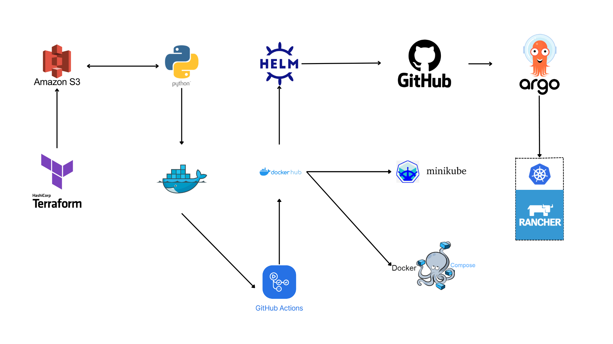
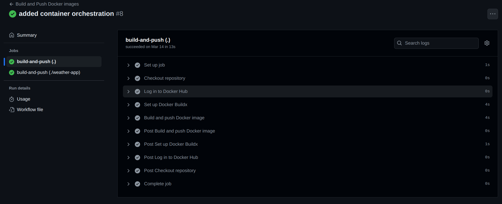
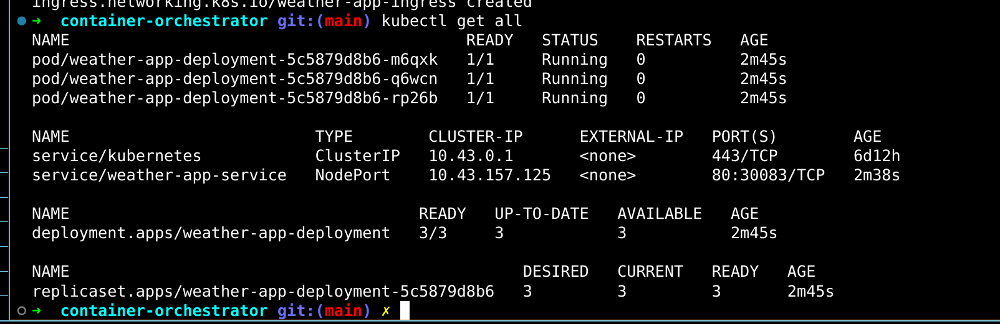
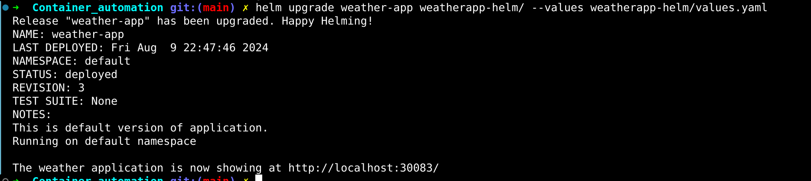
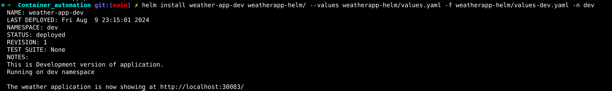
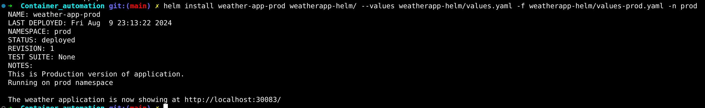
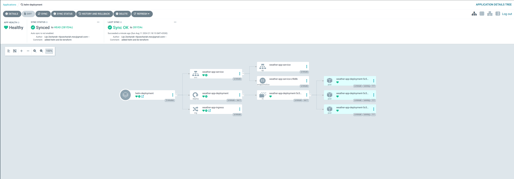
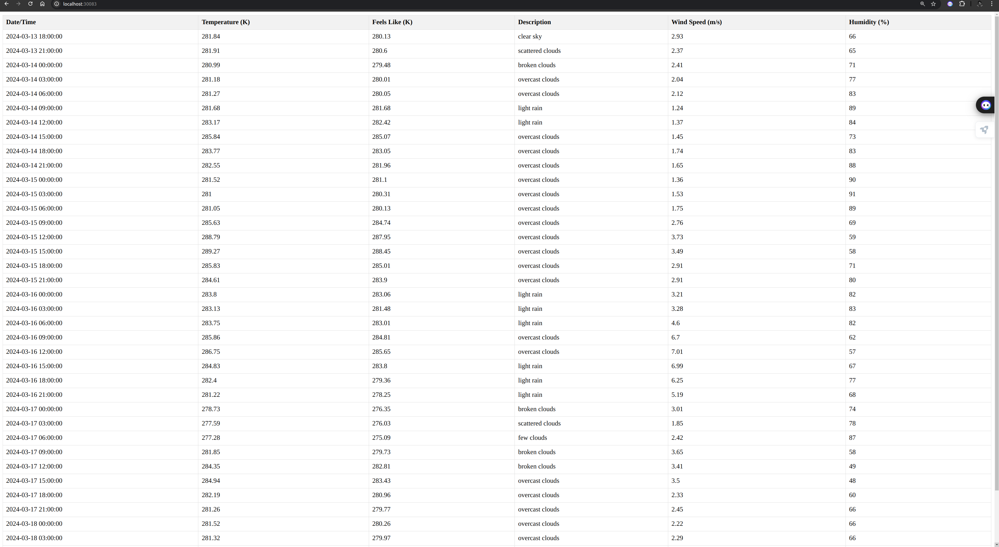

# Terraform and GitHub Actions for S3, CI/CD, and Kubernetes Deployment

This repository provides comprehensive Terraform configuration files for provisioning and managing an S3 bucket. It also includes GitHub Actions to run a CI/CD pipeline that builds and pushes Docker images. These images are then used to start a Kubernetes deployment on a local machine using Rancher Desktop. Uses Argo CD to monitor changes in github repo then make that change in K8s cluster.
I first developed this project for normal kubernetes deployment. Now It uses helm package manager to package the app. And deploy it into different usecases, like dev,prod etc..

 Instructions for setting up the deployment with Minikube are also provided. Plus files for starting a K8s cluster in digitalocean is also provided.




## Key Features

- **Terraform Configuration**: Automates the provisioning and management of an S3 bucket.
- **CI/CD Pipeline**: Utilizes GitHub Actions to automate the build and push of Docker images.
- **Docker compose Deployment**: Deployed using docker compose. It will be useful when we don't want to deploy without spining up a resource hungry kuberentes cluster.
- **Kubernetes Deployment**: Deploys applications locally using Rancher Desktop, with alternative instructions for Minikube. It uses argo cd for continuous deployments for the changes happend in github.

## Instructions

### Terraform Setup
1. Ensure Terraform is installed on your local machine.
2. Navigate to the `terraform` directory.
3. Run `terraform init` to initialize the Terraform configuration.
4. Execute `terraform apply` to provision the S3 bucket.

### CI/CD Pipeline
1. The repository contains a `.github/workflows` directory with GitHub Actions workflows.
2. Workflows automate the building and pushing of Docker images to a container registry.
3. Ensure your repository secrets include credentials for accessing the container registry.

### Kubernetes Deployment
- **Rancher Desktop**:
  - Rancher Desktop is an open-source project that provides a simple way to run Kubernetes clusters on your local machine. It offers an easy-to-use interface and powerful features for managing Kubernetes workloads.


- **Minikube**:
  - Minikube is a tool that allows you to run a single-node Kubernetes cluster on your local machine. It's designed for users looking to develop and test Kubernetes applications locally.


### AWS Credentials Setup

There are two ways to set up AWS credentials. Here, I've used a `.env` file, but AWS CLI is the most secure option.

#### AWS CLI Login

This guide outlines the steps to log in to AWS using the AWS Command Line Interface (CLI).

#### Prerequisites

Before proceeding, ensure you have the following:

- An AWS account
- AWS CLI installed on your local machine
- Access keys or IAM user credentials for your AWS account

##### Steps to Login

1. **Install AWS CLI:**

   If you haven't installed AWS CLI yet, you can follow the [official installation guide](https://docs.aws.amazon.com/cli/latest/userguide/cli-chap-install.html) provided by AWS.

2. **Configure AWS CLI:**

   Run the following command to configure AWS CLI with your access keys or IAM user credentials:

   ```bash
   aws configure
   ```

   You will be prompted to enter your AWS Access Key ID, AWS Secret Access Key, AWS region, and default output format.

#### .env File

If you don't want to use AWS CLI setup, create a `.env` file and copy the following content:

```dotenv
AWS_ACCESS_KEY_ID=<-AWS access key ID->
AWS_SECRET_ACCESS_KEY=<-AWS secret access key->
AWS_DEFAULT_REGION=<-AWS default region->
```

Then run:

```bash
source .env
```

### Getting Started

To get started with this Terraform project, follow these steps:

1. Clone the repository to your local machine:

    ```bash
    git clone https://github.com/lijozech-12/Container_automation.git
    ```

2. Install Terraform:

    Follow the [Terraform installation instructions](https://learn.hashicorp.com/tutorials/terraform/install-cli) to install Terraform on your machine.

3. Initialize Terraform:

    ```bash
    terraform init
    ```

4. Create `terraform.tfvars` and provide the values:

    ```dotenv
    aws_region                  = "us-east-1"
    instance_ami                = "ami-12345678"
    s3_bucket_name              = "lijos-test-bucket"
    weather-page-docker-compose = "/location to /weather-page-docker-compose.yml"
    ```

5. Review and Modify Terraform Configurations:

    Navigate to the `terraform` directory and review the `.tf` files to understand the infrastructure resources being managed.

6. Plan and Apply Terraform Changes:

    ```bash
    terraform plan
    terraform apply
    ```

## Saving Data into S3 Bucket

Now that the S3 bucket is set up, we need to insert data into the bucket. To do that, run the following command. It will start a Docker container and insert data into the database:

```bash
docker-compose -f weather-fetcher-docker-compose.yml up -d
```


## Starting Website Manually

Change the permission of the file:

```bash
chmod +x deploy.sh
```

Run the file:

```bash
./deploy.sh
```

This script is only to build and deploy it manuvally. It will automatically deployed using github actions.



Now deploy it by running the following command:

```bash
docker-compose -f weather-page-docker-compose.yml up
```


Visit the following link:

[http://localhost:83/](http://localhost:83/)


## Also deployed in the github pages below is the link

[GitHub Pages Site](https://lijozech-12.github.io/Container_automation/)


# Deployment with Rancher Desktop.

After setting up rancher desktop run the below commands

``` bash
cd container-orchestrator 
kubectl apply -f weather-app-deployment.yaml
kubectl apply -f weather-app-service.yaml
kubectl apply weather-app-ingress.yaml 
```

It will start running when you use `kubectl get all` to see all the resources.



# Using helm

Helm package is stored inside a weatherapp-helm folder.
You can start the cluster using following commands.

``` bash
# normal deployment
helm install weather-app weatherapp-helm/ --values weatherapp-helm/values.yaml
```


``` bash
# Dev deployment
helm install weather-app-dev weatherapp-helm/ --values weatherapp-helm/values.yaml -f weatherapp-helm/values-dev.yaml -n dev
```


``` bash
# Production deployment
helm install weather-app weatherapp-helm/ --values weatherapp-helm/values.yaml -f weatherapp-helm/values-prod.yaml -n prod
```


# Argo CD

Follow [Installation](https://argo-cd.readthedocs.io/en/stable/getting_started/) documentation to install Argo CD in your cluster.

Argo CD will help to continuously deploy changes pushed into github in the Kuberentes cluster.
After installing it Specify the github repo and it's path(In our case weatherapp-helm). It will take the code from repo and deploy it in our cluster.




##### Result

when you visit http://localhost:30083/ you can see the website.



# Weather App Deployment with Minikube

This guide provides step-by-step instructions for deploying the `weather-app` on a local Kubernetes cluster using Minikube.

## Prerequisites

Before you begin, you'll need to install the following tools:

- **kubectl**: The command-line tool for interacting with Kubernetes clusters. [Installation instructions](https://kubernetes.io/docs/tasks/tools/).
- **A Hypervisor**: Such as VirtualBox, VMware, Hyper-V, or Docker. This is needed for Minikube to create VMs.
- **Minikube**: Simplifies running Kubernetes locally. [Installation instructions](https://kubernetes.io/docs/tasks/tools/install-minikube/).

## Step 1: Start Minikube

Start a single-node Kubernetes cluster with Minikube:

```bash
minikube start
```
## Step 2: Enable Ingress Controller
Enable the built-in NGINX Ingress controller in Minikube:

```bash
minikube addons enable ingress
```
## Step 3: Deploy Your Application

Go inside k8's folder
```bash
cd container-orchestrator
```
Run the below commands

```bash
kubectl apply -f weather-app-deployment.yaml

```

## Step 4: Deploy the service

```bash
kubectl apply -f weather-app-service.yaml
```

## Step 5: Deploy an Ingress Resource

```bash
kubectl apply -f weather-app-ingress.yaml
```

## Step 5: Access Your Application
Find the IP address of your Minikube VM:
```bash
minikube ip
```
## Step 6:Access the application via your web browser:

[http://<-minikube-ip->/weather](http://<minikube-ip>/weather)
```
http://<minikube-ip>/weather
```

Replace *<-minikube-ip->* with the actual IP address.


```
helm install weather-app weatherapp-helm/
```